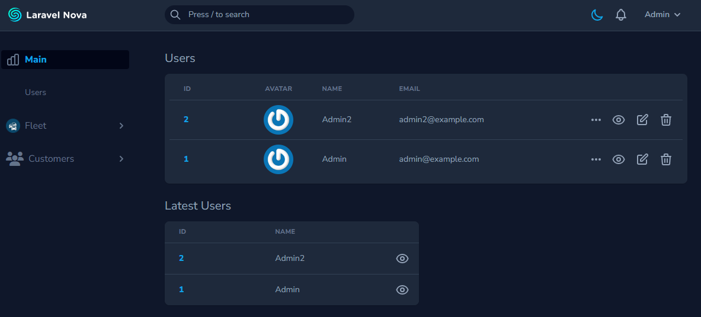
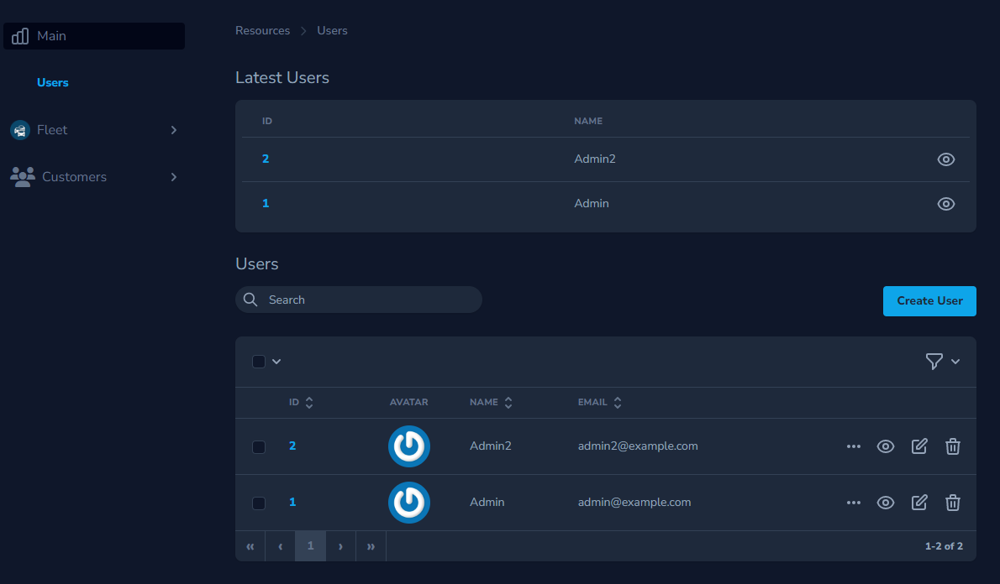

# Nova Resource Card

With this package You can use Nova Resources Index as Card.  
(For example on the Dashboard or other Nova resource)

Limitations:

* No search
* No pagination
* No actions
* No cards




Examples from [example-app-nvpRt7](https://github.com/Muetze42/example-app-nvpRt7)

This package will certainly be extended in the course of time. For suggestions and wishes
please [create an issue](https://github.com/Muetze42/norman-huth-nova-resource-card/issues).

<!-- 
Todo:

* Remove any NPM packages that are not needed
* Add footer link
* Add methods for modelResourceName
-->

# Install

```
composer require norman-huth/nova-resource-card
```

# Usage

This usage examples use the Laravel Nova User resource class as example.

## Add Nova Resource Card A Dashboard

```php
use NormanHuth\NovaResourceCard\NovaResourceCard;

class Main extends Dashboard
{
    /**
     * Get the cards for the dashboard.
     *
     * @return array
     */
    public function cards(): array
    {
        return [
            new NovaResourceCard(\App\Nova\Resources\User::class)
        ];
    }
}
```

## Add Nova Resource Card To A Other Nova Resource

```php
use NormanHuth\NovaResourceCard\NovaResourceCard;

class User extends Resource
{
    /**
     * Get the cards available for the request.
     *
     * @param NovaRequest $request
     * @return array
     */
    public function cards(NovaRequest $request): array
    {
        return [
            new NovaResourceCard(\App\Nova\Resources\CardUser::class),
        ];
    }
}
```

## Card Methods

### Set Card Width

`#[ExpectedValues(values: ['full', '1/3', '1/2', '1/4', '2/3', '3/4'])]`

```php
(new NovaResourceCard(\App\Nova\Resources\User::class))->width('1/2')
```

### Add Classes To Card Element

```php
(new NovaResourceCard(\App\Nova\Resources\User::class))->addCardClasses(['bg-white', 'dark:bg-gray-800'])
(new NovaResourceCard(\App\Nova\Resources\User::class))->addCardClasses('bg-white dark:bg-gray-800')
```

### Add Classes To Resource Heading

```php
(new NovaResourceCard(\App\Nova\Resources\User::class))->addResourceHeadingClasses(['bg-white', 'dark:bg-gray-800'])
(new NovaResourceCard(\App\Nova\Resources\User::class))->addResourceHeadingClasses('bg-white dark:bg-gray-800')
```

### Add Classes To Resource IndexErrorDialog

```php
(new NovaResourceCard(\App\Nova\Resources\User::class))->addResourceIndexErrorDialogClasses(['my-class', 'p-2'])
(new NovaResourceCard(\App\Nova\Resources\User::class))->addResourceIndexErrorDialogClasses('my-class p-2'')
```

### Add Classes To Resource IndexEmptyDialog

```php
(new NovaResourceCard(\App\Nova\Resources\User::class))->addResourceIndexEmptyDialogClasses(['my-class', 'p-2'])
(new NovaResourceCard(\App\Nova\Resources\User::class))->addResourceIndexEmptyDialogClasses('my-class p-2'')
```

### Add Classes To Resource ResourceTable

```php
(new NovaResourceCard(\App\Nova\Resources\User::class))->addResourceResourceTableClasses(['my-class', 'p-2'])
(new NovaResourceCard(\App\Nova\Resources\User::class))->addResourceResourceTableClasses('my-class p-2'')
```

---

### Advanced Usage

Create your own Nova resource to customize it even more.

You should set `$globallySearchable` to false so that this resource is not included in the global search.  
(See: [Disabling Global Search For A Resource](https://nova.laravel.com/docs/4.0/search/global-search.html#disabling-global-search-for-a-resource))

Examples Resource from [example-app-nvpRt7](https://github.com/Muetze42/example-app-nvpRt7)

```php
class CardUser extends Resource
{
    /**
     * The model the resource corresponds to.
     *
     * @var string
     */
    public static string $model = \App\Models\User::class;

    /**
     * Indicates if the resource should be globally searchable.
     *
     * @var bool
     */
    public static $globallySearchable = false;

    /**
     * Get the displayable label of the resource.
     *
     * @return string
     */
    public static function label(): string
    {
        return __('Latest Users');
    }

    /**
     * The pagination per-page options configured for this resource.
     *
     * @return array
     */
    public static $perPageOptions = [5];

    /**
     * Build an "index" query for the given resource.
     *
     * @param NovaRequest $request
     * @param \Illuminate\Database\Eloquent\Builder $query
     * @return \Illuminate\Database\Eloquent\Builder
     */
    public static function indexQuery(NovaRequest $request, $query): \Illuminate\Database\Eloquent\Builder
    {
        return $query->orderByDesc('created_at');
    }

    /**
     * Get the fields displayed by the resource.
     *
     * @param NovaRequest $request
     * @return array
     */
    public function fields(NovaRequest $request): array
    {
        return [
            ID::make()->sortable(),
            Text::make(__('Name'), 'name'),
        ];
    }

    /**
     * Determine if the current user can delete the given resource.
     *
     * @param  \Illuminate\Http\Request  $request
     * @return bool
     */
    public function authorizedToDelete(Request $request): bool
    {
        return false;
    }

    /**
     * Determine if the current user can restore the given resource.
     *
     * @param  \Illuminate\Http\Request  $request
     * @return bool
     */
    public function authorizedToRestore(Request $request): bool
    {
        return false;
    }

    /**
     * Determine if the current user can update the given resource.
     *
     * @param  \Illuminate\Http\Request  $request
     * @return bool
     */
    public function authorizedToUpdate(Request $request): bool
    {
        return false;
    }

    /**
     * Determine if the current user can force delete the given resource.
     *
     * @param  \Illuminate\Http\Request  $request
     * @return bool
     */
    public function authorizedToForceDelete(Request $request): bool
    {
        return false;
    }

    /**
     * Determine if the current user can replicate the given resource or throw an exception.
     *
     * @param  \Illuminate\Http\Request  $request
     * @return bool
     */
    public function authorizeToReplicate(Request $request): bool
    {
        return false;
    }

    // ...
```
